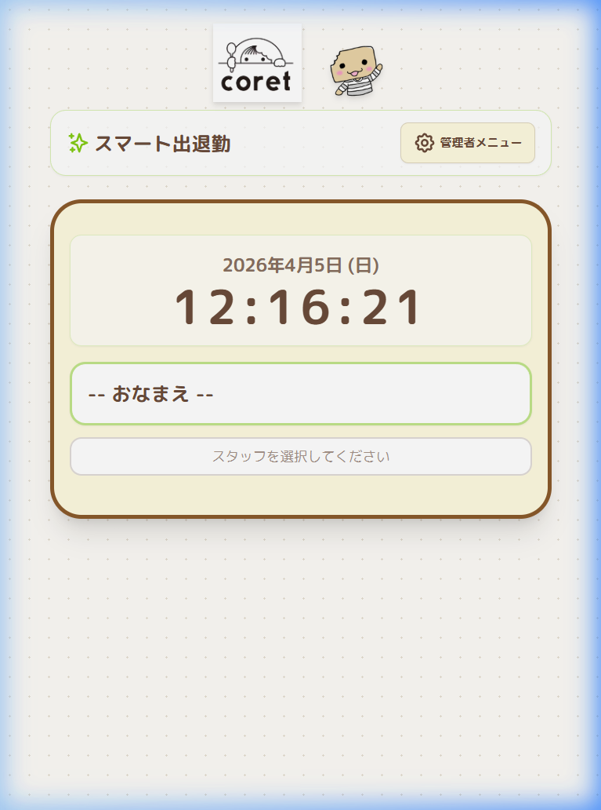
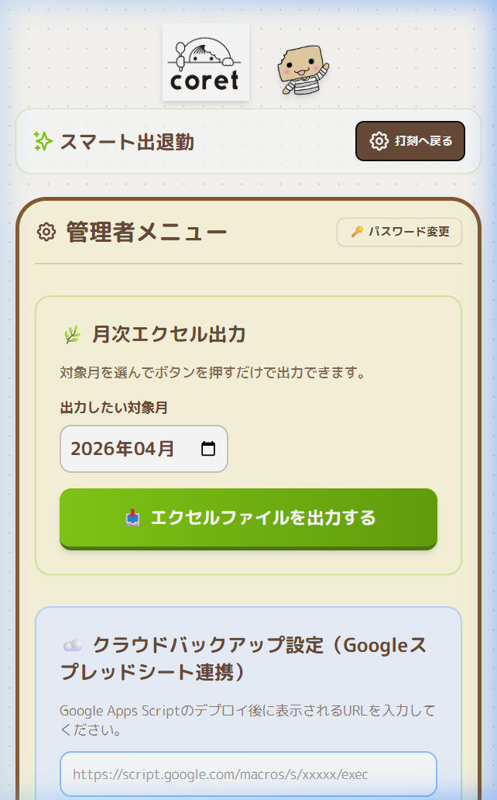
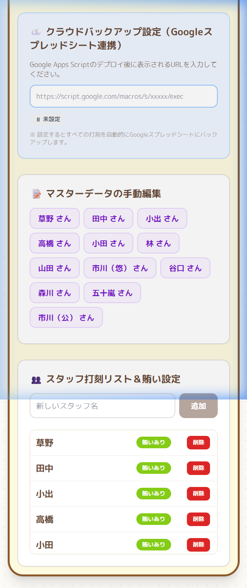

# 📋 スマート出退勤 取扱説明書【オーナー・店長用】

> **対象**: オーナー・店長・管理者  
> **アプリ**: スマート出退勤（timecard.html）  
> **最終更新**: 2026年4月

---

## 📖 目次

1. [はじめに](#1-はじめに)
2. [アプリの起動方法](#2-アプリの起動方法)
3. [画面の説明（トップ画面）](#3-画面の説明トップ画面)
4. [管理者メニューへのログイン](#4-管理者メニューへのログイン)
5. [管理者メニューの機能一覧](#5-管理者メニューの機能一覧)
6. [スタッフの登録・削除・賄い設定](#6-スタッフの登録削除賄い設定)
7. [月次エクセル出力（給与計算用）](#7-月次エクセル出力給与計算用)
8. [マスターデータの手動編集](#8-マスターデータの手動編集)
9. [クラウドバックアップ設定](#9-クラウドバックアップ設定)
10. [パスワードの変更](#10-パスワードの変更)
11. [データの仕組みと注意事項](#11-データの仕組みと注意事項)
12. [よくある質問（FAQ）](#12-よくある質問faq)

---

## 1. はじめに

「スマート出退勤」は、スタッフの出退勤をカンタンに記録・管理できるWebアプリです。  
スタッフがボタンを押すだけで打刻が完了し、月末には既存のExcelテンプレートに自動で書き出すことができます。

### このアプリでできること

| 機能 | 説明 |
|------|------|
| 🕐 出勤・退勤の打刻 | スタッフが自分で出退勤を記録 |
| ☕ 中抜け記録 | 休憩・外出の時間を記録 |
| 🥗 賄い管理 | 食事代の有無を自動記録 |
| 🏖 有給申請 | スタッフ自身が有給を申請可能 |
| 📊 月次Excel出力 | 既存のExcelフォーマットに自動入力して出力 |
| ☁️ クラウドバックアップ | Googleスプレッドシートに自動保存 |
| ✏️ 自己修正機能 | スタッフが自分で打刻を修正可能（ログ付き） |

---

## 2. アプリの起動方法

1. パソコンで `timecard.html` ファイルをダブルクリック
2. ブラウザ（Chrome推奨）で自動的に開きます
3. 以下のようなトップ画面が表示されます

> **💡 ポイント**: ブックマークに登録しておくと便利です。  
> インターネット接続がなくても打刻可能です（クラウドバックアップ以外）。

---

## 3. 画面の説明（トップ画面）

| 番号 | 要素 | 説明 |
|:----:|------|------|
| ① | **「スマート出退勤」ヘッダー** | アプリのタイトル |
| ② | **「管理者メニュー」ボタン** | 右上のボタン。管理者機能にアクセス |
| ③ | **日付・時計表示** | 現在の日時をリアルタイム表示 |
| ④ | **「-- おなまえ --」プルダウン** | スタッフを選択するドロップダウン |

---

## 4. 管理者メニューへのログイン

### 手順

1. 画面右上の **「⚙ 管理者メニュー」** ボタンをタップ
2. パスワード入力画面が表示されます
3. **初期パスワード `0000`** を入力して「OK」を押す
4. 管理者メニューが表示されます

> ⚠️ **重要**: 初期パスワードは `0000` です。セキュリティのため、必ず変更してください（→ [10. パスワードの変更](#10-パスワードの変更)）

---

## 5. 管理者メニューの機能一覧

管理者メニューには以下の機能があります：

| セクション | 機能 |
|------------|------|
| 🌿 **月次エクセル出力** | 対象月を選んでExcelファイルを出力 |
| ☁️ **クラウドバックアップ設定** | Googleスプレッドシート連携の設定 |
| 📝 **マスターデータの手動編集** | スタッフごとの打刻データを個別に確認・修正 |
| 👥 **スタッフ打刻リスト＆賄い設定** | スタッフの追加・削除・賄い設定 |
| 🔑 **パスワード変更** | 管理者パスワードの変更 |

---

## 6. スタッフの登録・削除・賄い設定

### スタッフを追加する

1. 管理者メニューの **「👥 スタッフ打刻リスト＆賄い設定」** セクションへ移動
2. **「新しいスタッフ名」** の入力欄にスタッフの名前を入力
3. **「追加」** ボタンを押す

### 賄い設定を変更する

- 各スタッフ名の横にある **「賄いあり」** ボタンをタップすると、ON/OFFが切り替わります
- 「賄いあり」の場合、出勤時に自動的に賄いがONになります

### スタッフを削除する

- 各スタッフ名の横にある **赤い「削除」** ボタンを押す
- 確認メッセージが出るので「OK」を押す

> ⚠️ **注意**: スタッフを削除しても過去の打刻データは消えません。ただし、プルダウンには表示されなくなります。

---

## 7. 月次エクセル出力（給与計算用）

毎月の勤怠データを既存のExcelフォーマットで書き出す機能です。

### 手順

1. 管理者メニューの **「🌿 月次エクセル出力」** セクションへ移動
2. **「出力したい対象月」** を選択（例：2026年04月）
3. **「📊 エクセルファイルを出力する」** ボタンを押す
4. ダウンロードが自動的に始まります

### 出力される内容

- 各スタッフのシートに **日付・曜日・出勤時間・退勤時間・中抜け・賄い** が自動入力
- **有給申請**の日は備考欄に「【有給申請】」と記録
- 対象月にデータがないスタッフのシートは **自動で削除** されます（マスタシートは残ります）

> **💡 ファイル名例**: `タイムカード入力_202604給与分_アプリ出力.xlsx`

---

## 8. マスターデータの手動編集

スタッフの打刻データを個別に確認・修正できます。

### 手順

1. **「📝 マスターデータの手動編集」** セクションで、対象スタッフ名をタップ
2. カレンダー形式の一覧が表示されます
3. 修正したい日付の行をタップ
4. 編集モーダルが開きます
5. 出勤・退勤・中抜け・賄い・備考を編集して **「保存する」** を押す

### できること

- **打刻の追加**: データがない日に新しく打刻を入力
- **打刻の修正**: 既存の記録を修正
- **打刻の取消**: 「完全取消」ボタンでデータを削除
- **有給申請の編集**: 「この日を有給申請にする」チェックのON/OFF

> **💡 管理者が修正した場合**は「本人修正済」マークは付きません。

---

## 9. クラウドバックアップ設定

Googleスプレッドシートに打刻データを自動バックアップする機能です。

### 設定手順

1. 管理者メニューの **「☁️ クラウドバックアップ設定」** セクションへ移動
2. Google Apps Script（GAS）のデプロイURLを入力欄に貼り付け
3. ステータスが **「✅ 連携ON」** になったことを確認
4. **「🔗 接続テスト」** ボタンで動作確認

> 📌 GASの設定手順は別紙 **「GAS設定手順書.md」** をご参照ください。

### バックアップの仕組み

| タイミング | 動作 |
|------------|------|
| 打刻時 | ローカル保存＋同時にGoogleスプレッドシートに送信 |
| 送信失敗時 | 未送信リストに保存 → 次回アプリ起動時に自動再送信 |
| スプレッドシート側 | スタッフごとにシートが自動作成 |

---

## 10. パスワードの変更

1. 管理者メニュー右上の **「🔑 パスワード変更」** ボタンを押す
2. 新しい **4桁の数字パスワード** を入力
3. 「OK」を押して完了

> ⚠️ **パスワードは忘れないように必ずメモしてください！**  
> 万が一忘れた場合は、ブラウザの開発者ツール（F12）→ Application → Local Storage → `admin_pin` で確認できます。

---

## 11. データの仕組みと注意事項

### データの保存場所

| 保存先 | 説明 |
|--------|------|
| **ブラウザ（LocalStorage）** | メインのデータ保存先。ブラウザの履歴を消すとデータも消えます |
| **Googleスプレッドシート** | クラウドバックアップ先（設定した場合） |

### ⚠️ 重要な注意事項

1. **ブラウザのキャッシュ・履歴をクリアしないでください**  
   → すべての打刻データが消えてしまいます

2. **別のPCやブラウザではデータは共有されません**  
   → 必ず同じPCの同じブラウザを使用してください

3. **月末には必ずExcel出力をしてください**  
   → ブラウザのデータだけに頼らず、ファイルとして保存しましょう

4. **クラウドバックアップの設定を強く推奨します**  
   → PCが故障してもGoogleスプレッドシートにデータが残ります

---

## 12. よくある質問（FAQ）

### Q. スタッフが打刻を忘れた場合は？
**A.** 2つの方法があります：
- **スタッフ自身が修正**: スタッフ画面の「今月の打刻履歴を見る・修正する / 有給申請」から修正可能です（備考に「本人修正済」と記録されます）
- **管理者が修正**: 管理者メニューの「マスターデータの手動編集」から修正できます

### Q. 有給申請はどうやって確認する？
**A.** 管理者メニューの「マスターデータの手動編集」で各スタッフの月間データを見ると、有給申請の日は【有給申請】と表示されます。Excel出力にも自動反映されます。

### Q. パソコンが壊れたらデータは消える？
**A.** クラウドバックアップを設定していれば、Googleスプレッドシートにデータが残っています。設定していない場合、ブラウザのLocalStorageに保存されたデータは失われます。

### Q. スタッフが修正したか確認するには？
**A.** 管理者メニューの「マスターデータの手動編集」で各スタッフの月間データを確認してください。スタッフが修正した日は備考欄に **「修正済」** マークが表示されます。

### Q. エクセル出力でエラーが出る場合は？
**A.** 以下を確認してください：
- ブラウザがChrome最新版かどうか
- ポップアップがブロックされていないか
- それでも解決しない場合はアプリを一度閉じて再度開いてください

---

> 📞 **お困りの際は**  
> 本マニュアルで解決できない場合は、システム管理者にご連絡ください。
