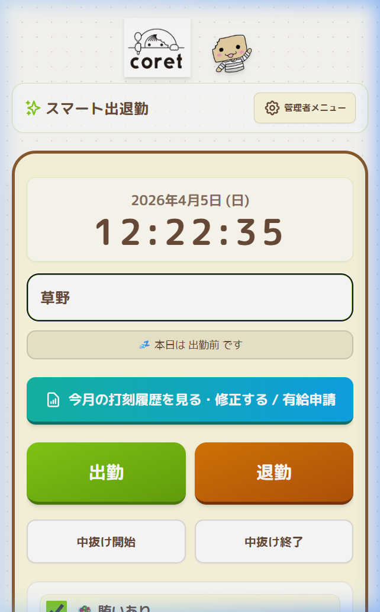

# 📋 スマート出退勤 取扱説明書【スタッフ用】

> **対象**: スタッフの皆さん  
> **アプリ**: スマート出退勤（timecard.html）  
> **最終更新**: 2026年4月

---

## 📖 目次

1. [はじめに](#1-はじめに)
2. [毎日の使い方（出勤〜退勤）](#2-毎日の使い方出勤退勤)
3. [中抜け（休憩・外出）の記録](#3-中抜け休憩外出の記録)
4. [賄いの設定](#4-賄いの設定)
5. [打刻履歴の確認・修正方法](#5-打刻履歴の確認修正方法)
6. [有給申請の出し方](#6-有給申請の出し方)
7. [よくある質問（FAQ）](#7-よくある質問faq)
8. [困ったときは](#8-困ったときは)

---

## 1. はじめに

「スマート出退勤」は、ボタンを押すだけでカンタンに出退勤を記録できるアプリです。  
紙のタイムカードの代わりに使います。

### ✅ あなたができること

- 🕐 **出勤・退勤**の打刻
- ☕ **中抜け**（休憩・外出）の記録
- 🥗 **賄い**の有無の切り替え
- ✏️ **打刻の修正**（押し忘れた場合など）
- 🏖 **有給の申請**

---

## 2. 毎日の使い方（出勤〜退勤）

### ステップ1：アプリを開く

パソコンの画面にあるアプリ（タイムカード）を開きます。  
以下のような画面が表示されます。

---

### ステップ2：自分の名前を選ぶ

**「-- おなまえ --」** と書かれたプルダウンをタップして、自分の名前を選びます。

名前を選ぶと、以下のボタンが表示されます：

| ボタン | 色 | 意味 |
|--------|:--:|------|
| **出勤** | 🟢 緑 | 仕事を始めるときに押す |
| **退勤** | 🟠 オレンジ | 仕事を終えるときに押す |
| **中抜け開始** | ⬜ 白 | 休憩や外出を始めるときに押す |
| **中抜け終了** | ⬜ 白 | 休憩や外出から戻ったときに押す |

---

### ステップ3：出勤ボタンを押す

仕事を始めるときに **「出勤」ボタン** を押します。

> ✅ 押すと「〇〇:〇〇に出勤しました」と表示されます。  
> ステータスが **「出勤中」** に変わります。

---

### ステップ4：退勤ボタンを押す

仕事が終わったら **「退勤」ボタン** を押します。

> ✅ 押すと「〇〇:〇〇に退勤しました」と表示されます。

---

### ⚠️ 大切なお約束

- **出勤ボタンは1日1回しか押せません**（2回押すと上書きされます）
- 退勤ボタンは出勤後にしか有効になりません
- **必ず自分の名前**を確認してから押してください（他の人の名前で打刻しないよう注意！）

---

## 3. 中抜け（休憩・外出）の記録

仕事中にお店を離れる場合（休憩・外出など）に使います。

### 手順

1. お店を離れるときに **「中抜け開始」** を押す
2. お店に戻ったときに **「中抜け終了」** を押す

> 💡 中抜けの時間は自動で計算され、勤務時間から差し引かれます。

---

## 4. 賄いの設定

画面下部に **「🥗 賄いあり」** のチェックがあります。

- ✅ チェックが **ON** → 賄いを食べる日
- ☐ チェックが **OFF** → 賄いなしの日

> 💡 通常は自動的に「あり」になっています。食べない日はチェックを外してください。

---

## 5. 打刻履歴の確認・修正方法

打刻を押し忘れたり、間違えた場合は **自分で修正** できます。

### 手順

1. 自分の名前を選んだ画面で、**「📊 今月の打刻履歴を見る・修正する / 有給申請」** ボタンを押す

2. カレンダー形式の一覧が表示されます

3. **修正したい日付の行をタップ** します

4. 編集画面が開きます

5. 以下の項目を修正できます：
   - **出勤時間**
   - **退勤時間**
   - **中抜け開始・終了**
   - **追加の休憩（分）**
   - **賄いの有無**
   - **備考**（コメントや理由を入力）

6. **「保存する」** ボタンを押して完了

### ⚠️ 修正時の注意

> スタッフが自分で修正した場合、備考欄に **「本人修正済」** と自動で記録されます。  
> これはオーナー・店長が確認できるようになっています。  
> **悪いことではありません** ─ むしろ正直に修正することが大切です！

### 打刻の完全取消

- 編集画面の左下にある **「完全取消」** を押すと、その日の全データを消去できます
- 確認メッセージが出るので、間違いがないか確認してから「OK」を押してください

---

## 6. 有給申請の出し方

有給を取りたい日を、アプリから申請できます。

### 手順

1. **「📊 今月の打刻履歴を見る・修正する / 有給申請」** ボタンを押す
2. カレンダー一覧で **まだ打刻がない日** を探す
3. その日の行にある **「有給」** ボタンを押す
4. **「🏖 この日を有給申請にする」** にチェックが入った画面が開きます
5. 必要に応じて **備考欄に理由** を入力
6. **「保存する」** ボタンを押す

### 有給申請後の表示

- カレンダー上で **【有給申請】** と表示されます
- 出勤・退勤は「-」と表示され、入力不要です

> 💡 有給申請は **オーナー・店長がExcel出力時に確認** します。  
> 事前に口頭でも伝えておきましょう。

---

## 7. よくある質問（FAQ）

### Q. 出勤ボタンを押し忘れた！
**A.** 大丈夫です！「📊 今月の打刻履歴を見る・修正する / 有給申請」から、その日をタップして出勤時間を手入力できます。

### Q. 間違えて他の人の名前で打刻してしまった！
**A.** すぐにオーナー・店長に伝えてください。管理者メニューから修正できます。

### Q. 退勤を押し忘れて帰ってしまった！
**A.** 翌日に「📊 今月の打刻履歴を見る・修正する / 有給申請」から修正してください。実際の退勤時間を入力できます。

### Q. 「本人修正済」って怒られますか？
**A.** いいえ！打ち忘れは誰にでもあります。正直に修正してくれるほうが助かります。修正したことが記録に残るだけなので、安心して修正してください。

### Q. 画面が動かない・固まった場合は？
**A.** ブラウザをいったん閉じてから、もう一度アプリを開いてください。打刻データは保存されています。

### Q. スマホからも使えますか？
**A.** このアプリは **お店のパソコン** で使うことを想定しています。スマホのブラウザでも表示はできますが、データはパソコンとは別になります。

---

## 8. 困ったときは

| こんなとき | 対処法 |
|------------|--------|
| 自分の名前がない | オーナー・店長に追加を依頼してください |
| ボタンが反応しない | ブラウザを更新（F5キー）してみてください |
| 画面がおかしい | ブラウザを閉じて再度開いてください |
| わからないことがある | オーナー・店長に聞いてください |

---

> 📌 **お願い**  
> - 毎日、出勤・退勤のボタンを忘れずに押してください  
> - 押し忘れた場合は、できるだけ早く自分で修正してください  
> - 不明点があればオーナー・店長にお気軽にどうぞ！
